---

copyright:
  years: 2025
lastupdated: "2026-02-26"

keywords:

subcollection: pattern-transit-vpc-fortigate

---

{{site.data.keyword.attribute-definition-list}}

# Deployment
{: #deployment}


## FortiGate Deployment (Cross Zone HA)
{: #fortigate-deployment-cross-zone-ha}

In order to deploy the FortiGate appliance in HA mode (Active/Passive) in a Cross Zone mode, select this offering in the catalog.

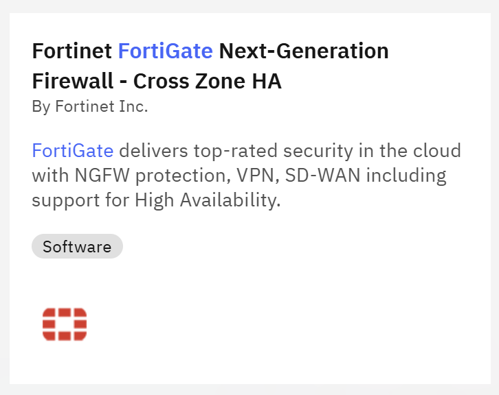{: caption-side="bottom"}

You'll be presented with a set of parameters that you must specify to correctly deploy and configure the appliances. An IBM Cloud Schematics workspace will be created automatically to run a Terraform script.

Below is a list of parameters. The values shown are illustrative for this particular deployment and should be modified as appropriate for your setup:

| Variable | Description | Value |
|----------|-------------|-------|
| CLUSTER_NAME | Name of the cluster (must be lowercase) | fortigate-ha-mzr |
| FGT1_STATIC_IP_PORT1 | The static IP address to be assigned to Port 1 of the Primary (ACTIVE) FortiGate | 10.0.0.10 |
| FGT1_STATIC_IP_PORT2 | The static IP address to be assigned to Port 2 of the Primary (ACTIVE) FortiGate | 10.0.1.10 |
| FGT1_STATIC_IP_PORT3 | The static IP address to be assigned to Port 3 of the Primary (ACTIVE) FortiGate | 10.0.2.10 |
| FGT1_STATIC_IP_PORT4 | The static IP address to be assigned to Port 4 of the Primary (ACTIVE) FortiGate | 10.0.3.10 |
| FGT2_STATIC_IP_PORT1 | The static IP address to be assigned to Port 1 of the Secondary (PASSIVE) FortiGate | 10.0.64.10 |
| FGT2_STATIC_IP_PORT2 | The static IP address to be assigned to Port 2 of the Secondary (PASSIVE) FortiGate | 10.0.65.10 |
| FGT2_STATIC_IP_PORT3 | The static IP address to be assigned to Port 3 of the Secondary (PASSIVE) FortiGate | 10.0.66.10 |
| FGT2_STATIC_IP_PORT4 | The static IP address to be assigned to Port 4 of the Secondary (PASSIVE) FortiGate | 10.0.67.10 |
| FGT1_PORT4_MGMT_GATEWAY | The gateway IP address for Port 4 (HA management port) on the Primary (ACTIVE) | 10.0.3.1 |
| FGT2_PORT4_MGMT_GATEWAY | The gateway IP address for Port 4 (HA management port) on the Secondary (ACTIVE) | 10.0.67.1 |
| IBMCLOUD_API_KEY | The IBM Cloud API Key to be used for the SDN Connector on FortiGate | |
| NETMASK | The subnet mask for the static IP address and NIC of each FortiGate (for all the interfaces) | 255.255.255.0 |
| PAR_ADDRESS_COUNT | The number of IPv4 addresses in this public address range | 4 |
| PROFILE | The IBM Cloud VSI profile for the FortiGate appliances; default is cx2-2x4 | cx2-2x4 |
| REGION | The IBM Cloud region for the deployment | eu-de |
| RESOURCE_GRP | The Resource Group Name to attach to the FortiGate instances | andygroth-rg |
| SECURITY_GROUP | The Security Group to attach to all the FortiGate instance Network Interfaces | chatting-vast-exclude-posted |
| SSH_PUBLIC_KEY | The name of the SSH public key to be used (previously created) | andy-key |
| SUBNET_1_Z1 | The ID of the subnet used for port1 on the Active FortiGate | 02b7-50aacd19-111e-4dbb-af40-e9414856326b |
| SUBNET_1_Z2 | The ID of the subnet used for port1 on the Passive FortiGate | 02c7-8f189050-522d-406e-98d7-8ba6baa29ce6 |
| SUBNET_2_Z1 | The ID of the subnet used for port2 on the Active FortiGate | 02b7-6a452ae6-6dbd-4e4f-b168-447a13335feb |
| SUBNET_2_Z2 | The ID of the subnet used for port2 on the Passive FortiGate | 02c7-1d4394ec-ce35-45ba-b978-8cc690d2b65d |
| SUBNET_3_Z1 | The ID of the subnet used for port3 on the Active FortiGate | 02c7-9b5d5c8a-3b26-4098-ad9e-27ba7798e69d |
| SUBNET_3_Z2 | The ID of the subnet used for port3 on the Passive FortiGate | 02b7-e3a8d46c-06ed-452d-aefd-82994e545d87 |
| SUBNET_4_Z1 | The ID of the subnet used for port4 on the Active FortiGate | 02b7-aceb9532-007a-4835-8d14-fbc48f8d51e9 |
| SUBNET_4_Z2 | The ID of the subnet used for port4 on the Passive FortiGate | 02c7-21caee8f-e1c5-4a36-9f3c-53a3e4f9a655 |
| VPC | The name of the VPC you want to deploy a FortiGate into | transit-vpc |
| ZONE_1 | The IBM Cloud zone in the region where to deploy the Ctive FortiGate | eu-de-1 |
| ZONE_2 | The IBM Cloud zone in the region where to deploy the Passive FortiGate | eu-de-2 |
{: caption="Table 1. Deployment parameters" caption-side="bottom"}

See below the set of parameters as presented in the UI for the Schematics workspace.

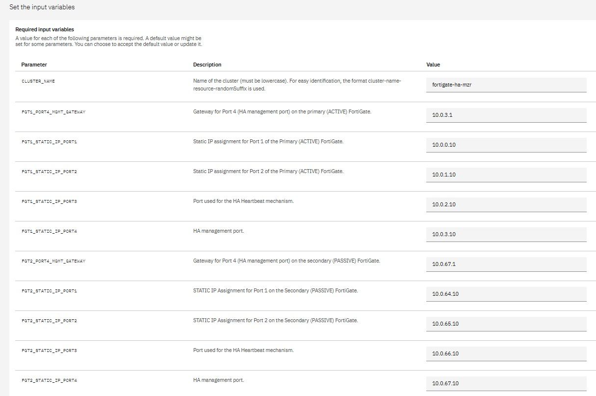{: caption="Image 3" caption-side="bottom"}

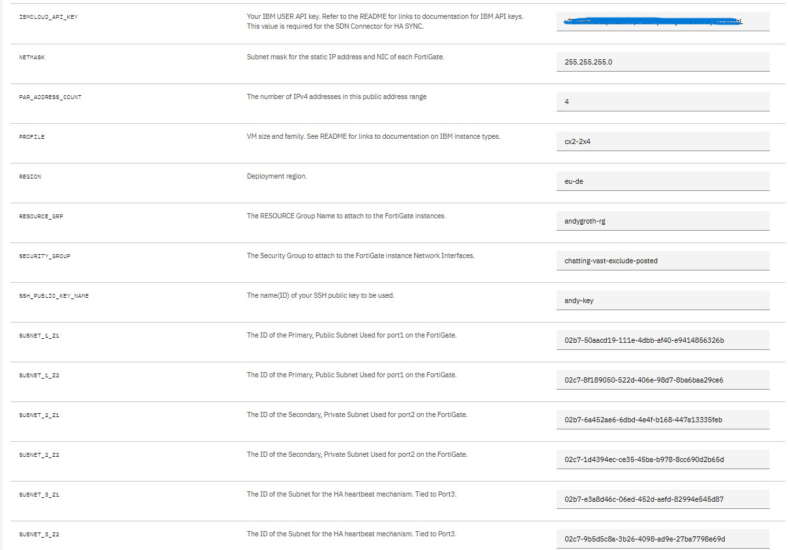{: caption="Image 4" caption-side="bottom"}

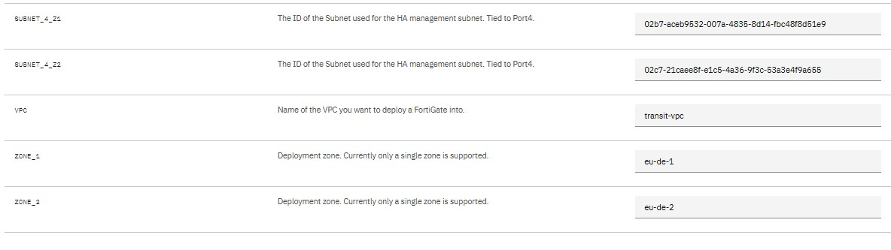{: caption="Image 5" caption-side="bottom"}


## Fortigate appliances description
{: #fortigate-appliances-description}

Once the deployment of the FortiGate appliances is complete, you can see two new VSIs deployed into the VPC where the first one is the active and the second one the passive. You should see something like this

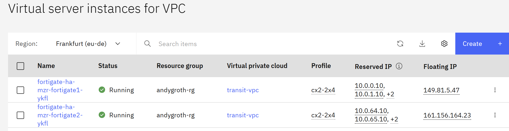{: caption="Image 6" caption-side="bottom"}

In the Networking tab you should see the list of the VNIs that have been created for each Fortigate. Each of these VNIs corresponds to a “physical” interface on Fortigate.

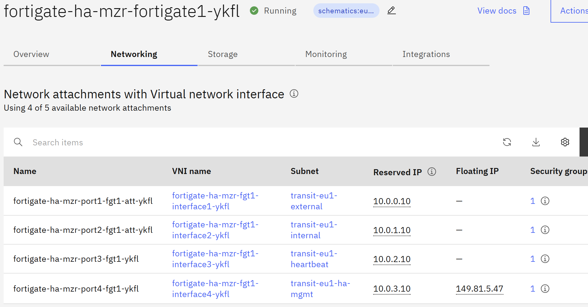{: caption="Image 7" caption-side="bottom"}

Port 1 is the external port, used for all the connectivity from/to the IBM Cloud.

Port 2 is for the internal traffic so between the Spoke VPCs

Port 3 is a dedicated port for Heartbeat for the High Availability. See the Fortinet documentation: https://docs.fortinet.com/document/fortigate/7.6.5/administration-guide/849059/ha-heartbeat-interface

Port 4 is dedicated to the HA Reserved Management Interface. This interface allows direct management access to each unit in the cluster using separate IP addresses by reserving a specific management port within the HA configuration. For more details, refer to the Fortinet documentation: https://community.fortinet.com/t5/FortiGate/Technical-Tip-HA-Reserved-Management-Interface/ta-p/190132

*The interface with assigned public IP addresses should be protected by leveraging either VPC Security Groups or the vFSA trusthost capability to enforce access controls (see: https://docs.fortinet.com/document/fortigate/6.4.0/hardening-your-fortigate/582009/system-administrator-best-practices)*


It should be considered that each VSI in IBM Cloud VPC supports a maximum of five virtual network interfaces (VNIs). Moreover, the instance’s aggregate network throughput is evenly apportioned across all attached VNIs; consequently, dedicating interfaces to management and HA heartbeat traffic, both typically low bandwidth, can reduce the effective headroom available to data plane interfaces. Both constraints can be solved by selecting VPC Gen 4 profiles, which provide enhanced networking characteristics (see: https://cloud.ibm.com/docs/vpc?topic=vpc-general-purpose-vsi-profiles-gen4-intel&interface=ui).


See here the configuration for the High Availability:

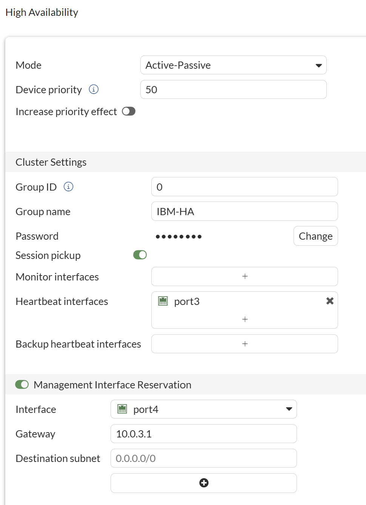{: caption="Image 8" caption-side="bottom"}

Initiate the Fortigate

The admin password to login the first time is the VSI ID as shown in the screenshot.

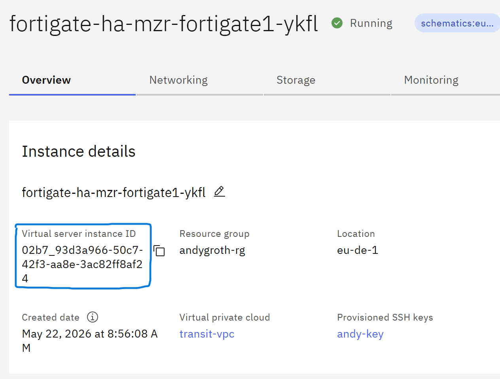{: caption="Image 9" caption-side="bottom"}

Use the Web UI to change the admin password at the first logon.

At the very first login, you are asked to apply for the license; please follow the procedure as described in the Fortinet documentation (you’ll be requested to reboot the two appliances during the process)
https://docs.fortinet.com/document/fortigate-private-cloud/7.6.0/vmware-esxi-administration-guide/299485/uploading-the-fortigate-vm-license

If the WebUI should not work because the FortiGate is not licensed yet, use the procedure as described in this document in the “To upload the license using SCP” paragraph https://docs.fortinet.com/document/fortigate/7.6.6/administration-guide/416169

Once the license is applied, you can check the High Availability is already configured, you should see something like this in the UI:

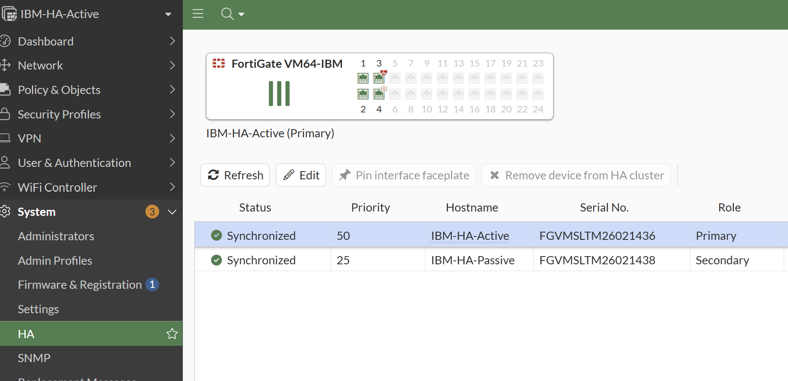{: caption="Image 9" caption-side="bottom"}


## The Public Address Range subnet and route the public traffic
{: #the-public-address-range-subnet-and-route-the-public-traffic}

A Public Address Range (PAR) is created automatically when you deploy the Fortigate pair; this will allow public connectivity to the applications behind the firewall.

You should see something like this in the list of the PARs.

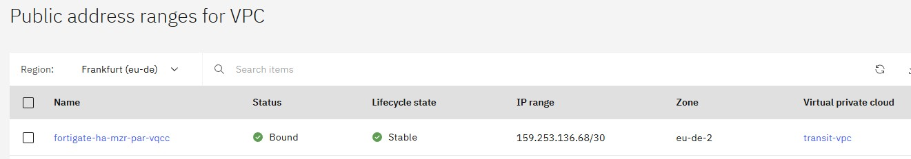{: caption="Image 12" caption-side="bottom"}

Also the route for this PAR is already created by the automation:
Go to the Routing Tables, select the VPC transit-vpc and you should see something like this:

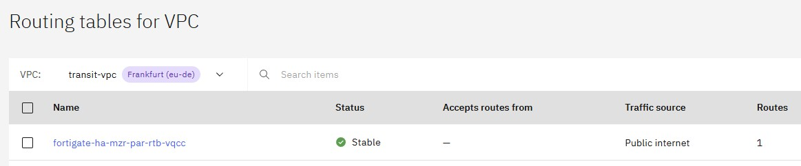{: caption="Image 13" caption-side="bottom"}

Once you select it, you should see this in the route table:

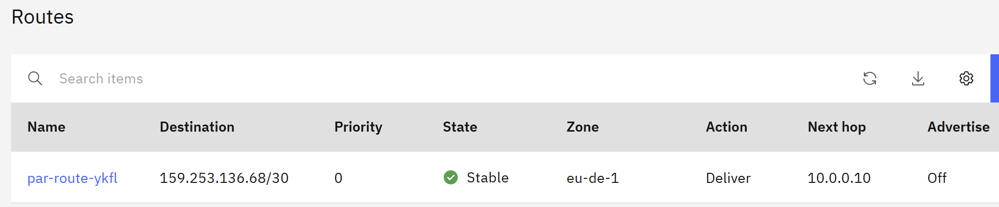{: caption="Image 14" caption-side="bottom"}

Where 10.0.0.10 is the IP address of the interface Port 1 in the Active Fortigate.

## Outbound connectivity from the Spoke VPCs
{: #outbound-connectivity-from-the-Spoke-vpcs}

Moreover, in order to allow outbound connectivity from the spoke VSIs to internet, we have to add a new route into the route table for the Transit Gateway.

Select the route table that has the transit Gateway as Traffic source

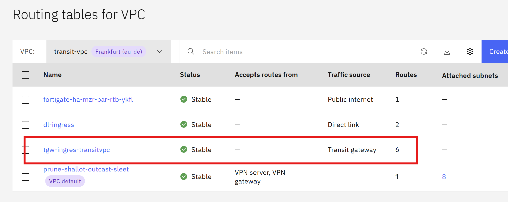{: caption="Image 19" caption-side="bottom"}

And configure the default route like this

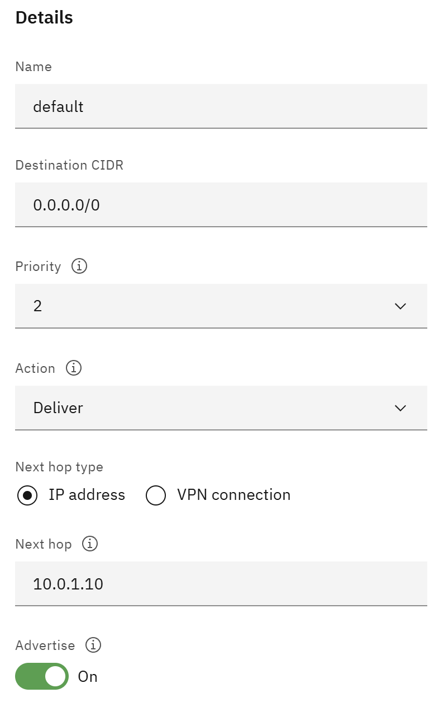{: caption="Image 20" caption-side="bottom"}

You should see these routes in your routing table:

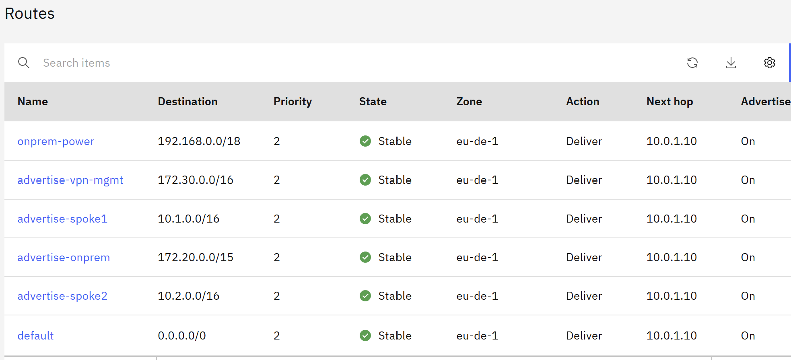{: caption="Image 21" caption-side="bottom"}

You can check that this route has been advertised into the Transit Gateway (run a new Generate report):

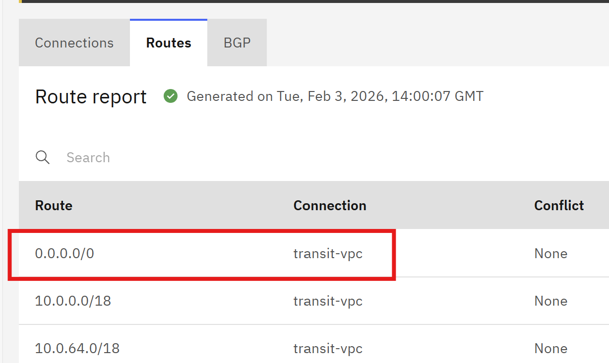{: caption="Image 22" caption-side="bottom"}

## Route for the Direct Link
{: #route-for-the-direct-link}

The last step is to configure the route for the routing table for the traffic having source the Direct Link.

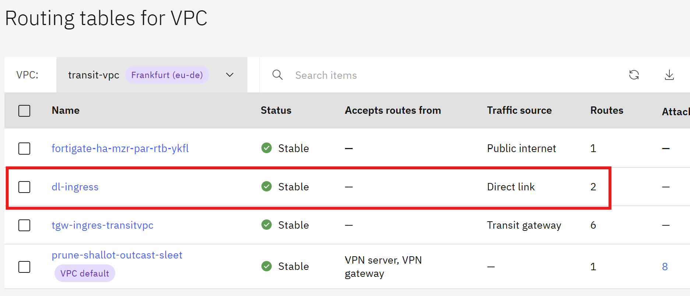{: caption="Image 23" caption-side="bottom"}

Once selected, setup the route for the Spoke VPCs to be routed through the Port 1 on the FortiGate (IP 10.0.0.10). You should see something like this:

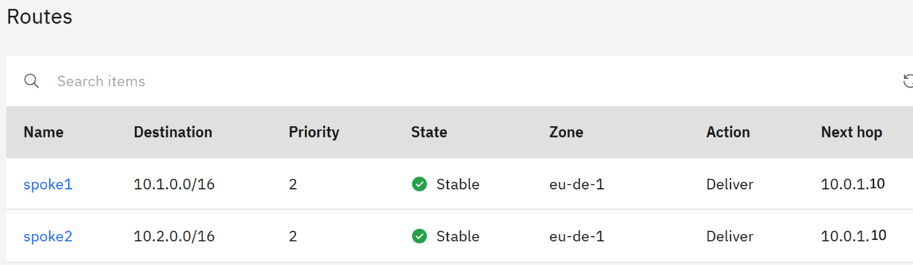{: caption="Image 24" caption-side="bottom"}


## Enabling spoofing
{: #enabling-spoofing}

If VPC routes are configured to use a FortiGate interface as the next hop, IP spoofing needs to be enabled on that interface so that it can forward traffic correctly.

In our case it should be enabled on port 1 and port 2; see this example.


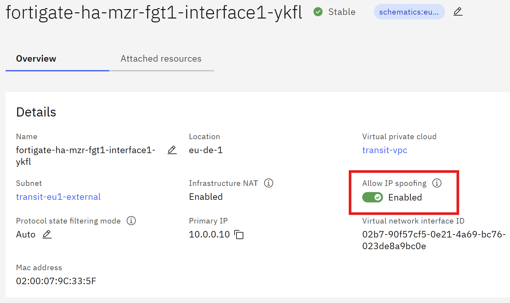{: caption="Image 25" caption-side="bottom"}


### Configure the static routes on Fortigate
{: #configure-the-static-routes-on-fortigate}

in a public cloud environment, standard static route configurations should not be synchronized because primary and secondary nodes require different gateway IPs depending on their availability zones.

In order to achive that, we disable the HA sync for the static route, by running this command via th Fortigate CLI
```text
config system vdom-exception
edit 1
set object router.static
next
end
```
{: codeblock}

Once the syncronization for static routes has been disabled, we can, we have to configure them for both the external and internal traffic where the gateway is the gateway of the subnets for the IP of both the “traffic” port (port1 and port2). In our case the gateway IPs is 10.0.0.1 and 10.0.1.1 for the zone 1 and 10.0.64.1 and 10.0.65.1 for the zone 2.

The Destination subnets are all the subnets to be connected inside the Cloud and to subnets connected via VPN and Direct Link.

The two fortigate will have the static routes as in the following pictures

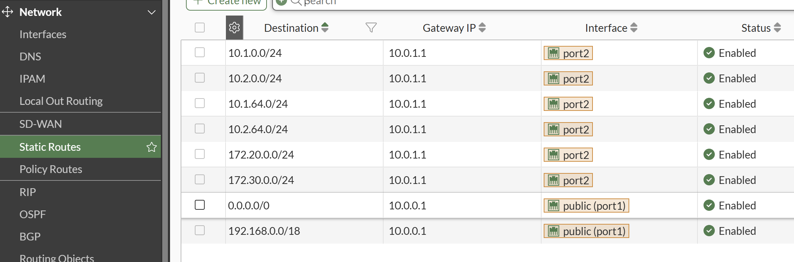{: caption="Image 26" caption-side="bottom"}

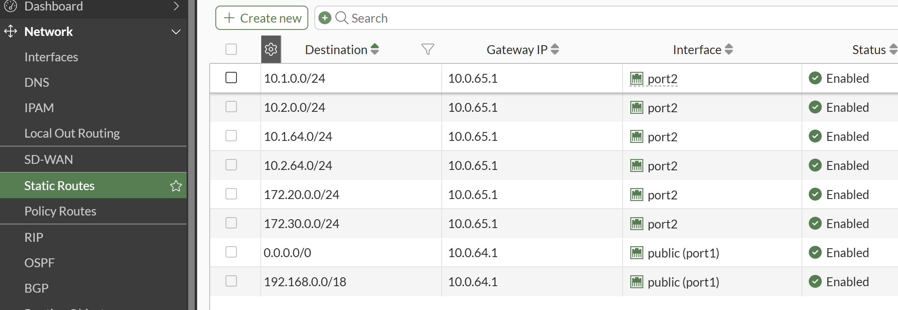{: caption="Image 27" caption-side="bottom"}


## Configure the firewall policy
{: #configure-the-firewall-policy}

First of all, in the Foritgate UI we create an address under Policies and Object -> Addresses to assign to the PowerVS subnet, something like this

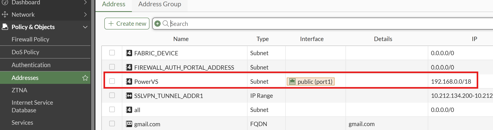{: caption="Image 28" caption-side="bottom"}

As very first configuration, we create a firewall policy that allows any traffic that has as source and destination the port 2, for the internal traffic. You should have something like this.

Notice the Implicit Deny policy is created by default once the FortiGate is deployed.

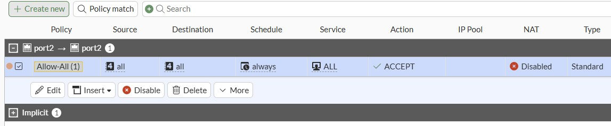{: caption="Image 29" caption-side="bottom"}

Then we create two policies to allow traffic from/to PowerVS, using port1 and port2 and the Address we created. You should see something like this

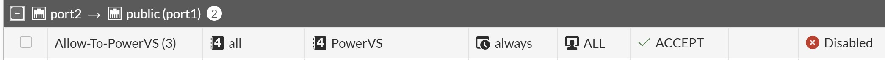{: caption="Image 30" caption-side="bottom"}
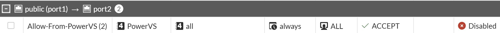{: caption="Image 31" caption-side="bottom"}

## Tutorial, testing connectivity
{: #tutorial-testing-connectivity}

This section describes the connectivity test to validate the various use cases.


### From server connected via the VPN to Spokes and vice versa
{: #from-server-connected-via-the-vpn-to-spokes-and-vice-versa}

In order to test the connectivity between the VSIs into the Spoke VPCs and the remote servers connected via the VPN tunnel, login into this server and ping the four VSIs. You should see the ping is successful like this.

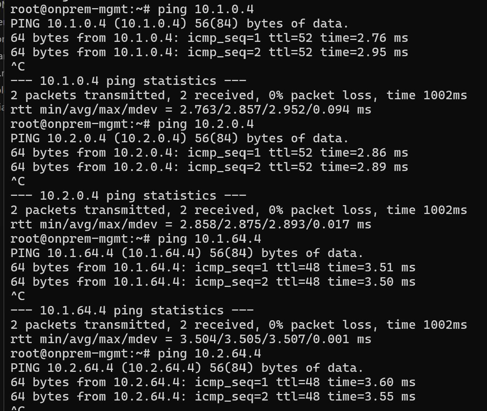{: caption="Image 32" caption-side="bottom"}


The outbound connectivity can be tested by pinging the remote server from the VSIs in one of the spoke VPCs. You should see the ping is successful like this (in this example is from the VSI in the Spoke 1 VPC and in the zone 1):

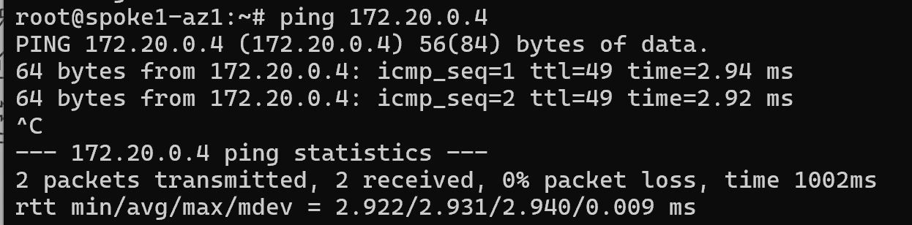{: caption="Image 33" caption-side="bottom"}


### From Power (DL) to Spokes and vice versa
{: #from-power-dl-to-spokes-and-vice-versa}

In order to test the connectivity between the VSIs into the spoke VPCs and the remote servers connected via the Direct Link, login into the PowerVS VSI and ping the four VSIs. You should see the ping is successful like this.

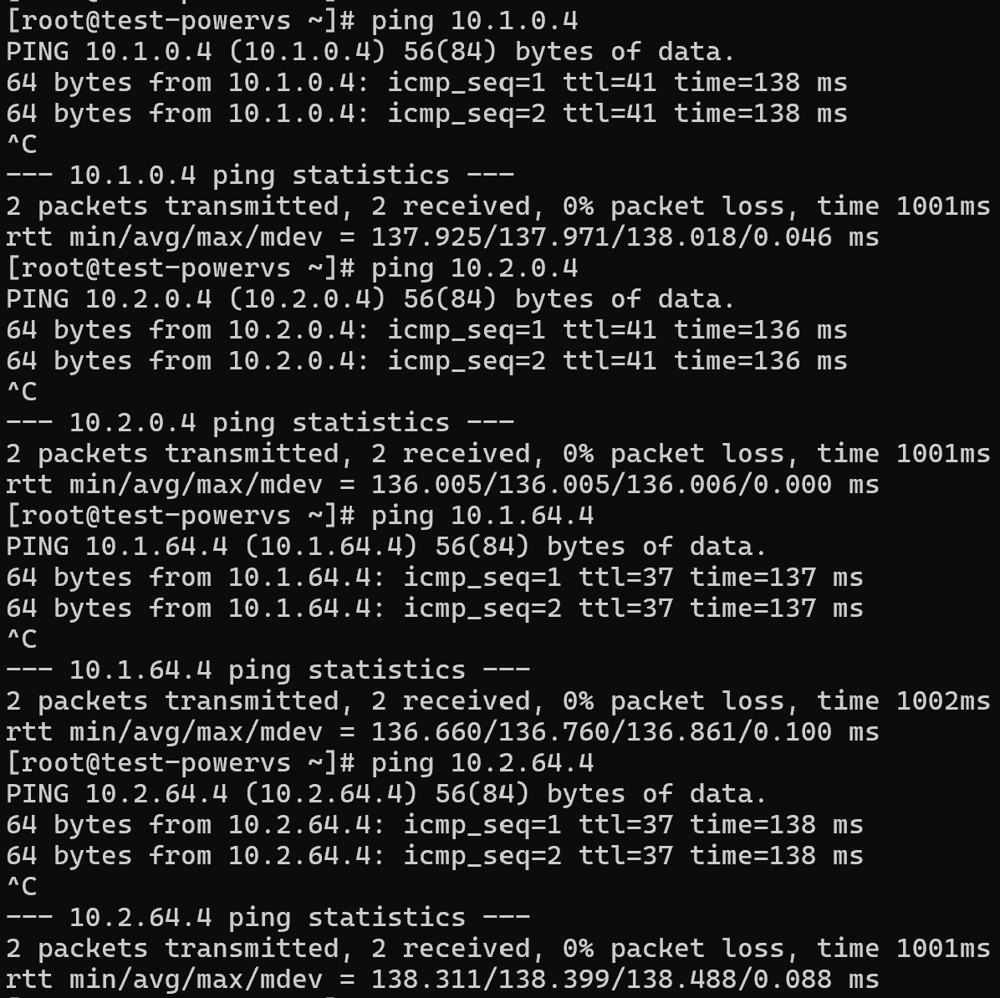{: caption="Image 34" caption-side="bottom"}

Please note that, if the PowerVS is connected to a public network with a second interface, its default route is configured to use this interface. This means that we need to add a static route in the PowerVS to route the traffic to the VPC Spoke VSIs through the private network. You should see something like this:

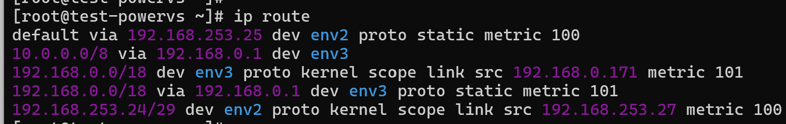{: caption="Image 35" caption-side="bottom"}

Where all the 10.0.0.0/8 subnet (that includes all the subnets in the Spoke VPCs) is routed via the gateway on the private interface env3.

We can test also we can ping the PowerVS VSI from one of the VSIs in the Spoke VPCs.

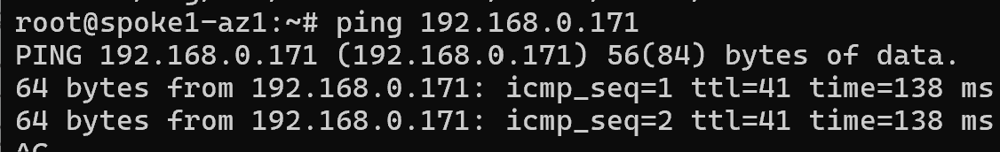{: caption="Image 36" caption-side="bottom"}


### From Spoke 1 to Spoke 2
{: #from-spoke-1-to-spoke-2}

In order to test the connectivity between the VSIs into the spoke VPCs, login into one of the VSI in one spoke VPC and ping the other spoke VPC. You should see the ping is successful (in this case the test is from the VSI in the Spoke 1 VPC and in the zone 1 and from the VSI in the Spoke 2 VPC and in the zone 2)

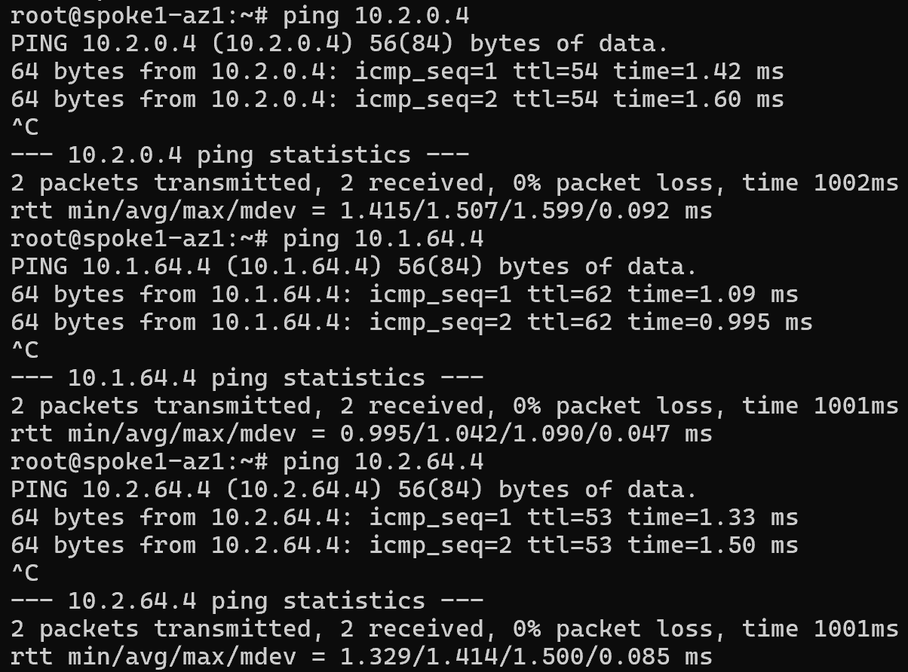{: caption="Image 37" caption-side="bottom"}

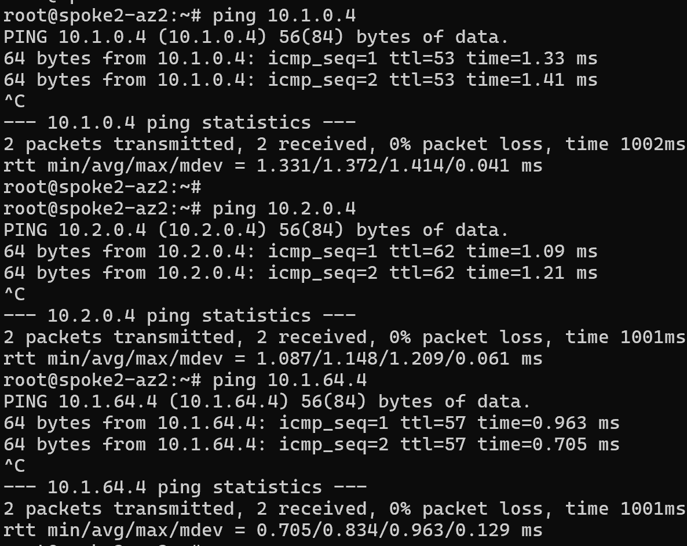{: caption="Image 38" caption-side="bottom"}

### From Internet to Spoke VSIs and from Spoke VSIs to internet
{: #from-internet-to-spoke-vsis-and-from-spoke-vsis-to-internet}

In order to enable access to one of the VSI into the spoke VPCs from internet and also to allow the VSI to access some services on internet, we have to do some additional configuration in FortiGate.

Here are the steps to allow inbound connectivity:

Create four Virtual IPs that maps the IP addresses in the Public Address Range to the private IP address of the VSIs. The interface where the “translation” happens is the interface dedicated to the public traffic (port 1)

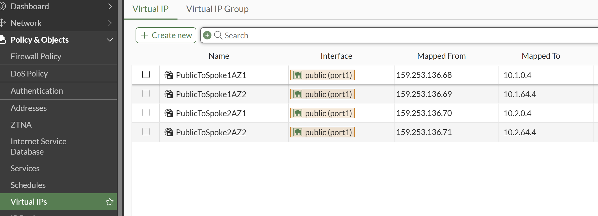{: caption="Image 39" caption-side="bottom"}

Create a Firewall Policy that allows traffic from port 1 to port 5. The destination MUST be the Virtual IPs just created. Moreover, the NAT option must be disabled.

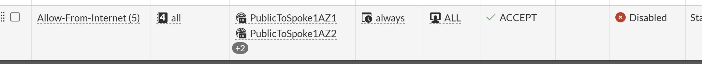{: caption="Image 40" caption-side="bottom"}

Try to ping the VSIs from internet, by using the public IP addresses. The VSIs should be reachable.

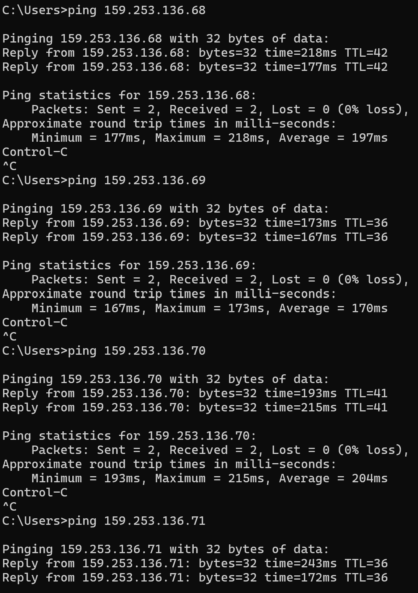{: caption="Image 41" caption-side="bottom"}


Here are the steps to allow outbound connectivity (from the VSIs to internet):

Create a Firewall Policy that allows traffic from the internal interface (port 2) to the public interface (port 1). In this case the NAT option must be selected.

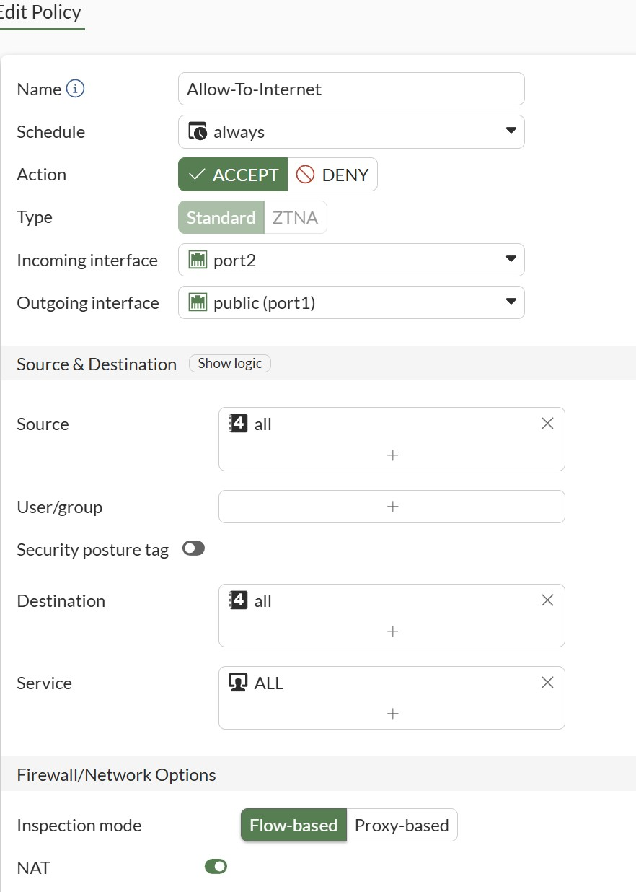{: caption="Image 42" caption-side="bottom"}

It should be noted that the VSI IP addresses are NAT'ed to the Public Address Range ip addresses as defined in the Virtual IPs configuration only if the Public Gateway for the Subnet 1 (the IP address of the Port 1 belongs to it).
If the Public Gateway needs to enabled in order to allow outbound connection for the Fortigate virtual appliance (for example for updates or FortiGard subscription), you shoud create a new route for the default Route Table for the transit-vcp, like in this example:

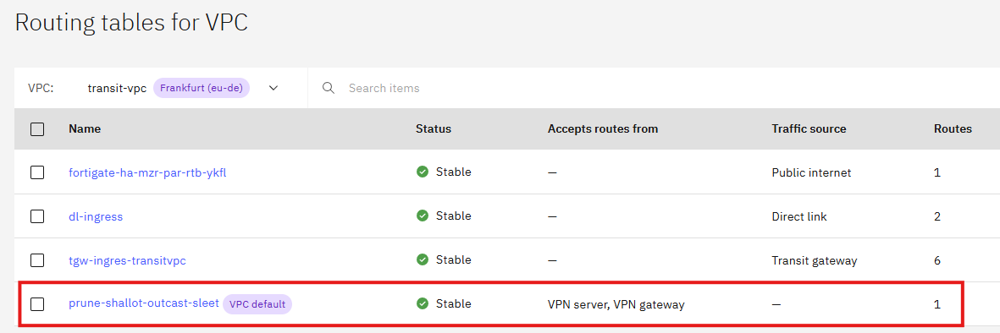{: caption="Image 43" caption-side="bottom"}

The route should have as destination the PAR subnet and have as Action Delegate-VPC; the VPC will not route this subnet and so the NAT will be demanded to the Fortigate and not anymore to the VPC (through the Public Gateway); see this example

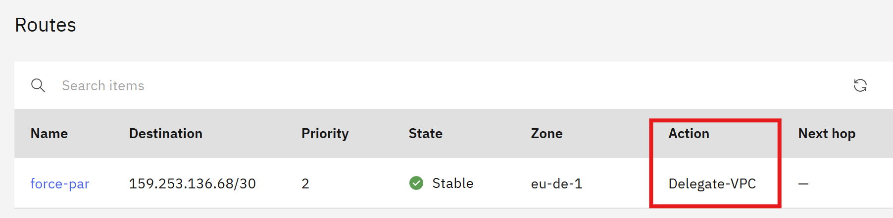{: caption="Image 44" caption-side="bottom"}


### Testing the High Availability failover
{: #testing-the-high-availability-failover}

As the setup on the Fortigate pair and on the IBM Cloud is complete, we can test a scenario where the primary Fortigate goes down.

The Secondary Fortigate should take over and the SDN Connector, already configured on the Fortigate at deployment time, should allow the reconfiguration of all the routes in the IBM Cloud VPC.

You should see the IBM Cloud Connector already deployed and configured in your FortiGate, like this

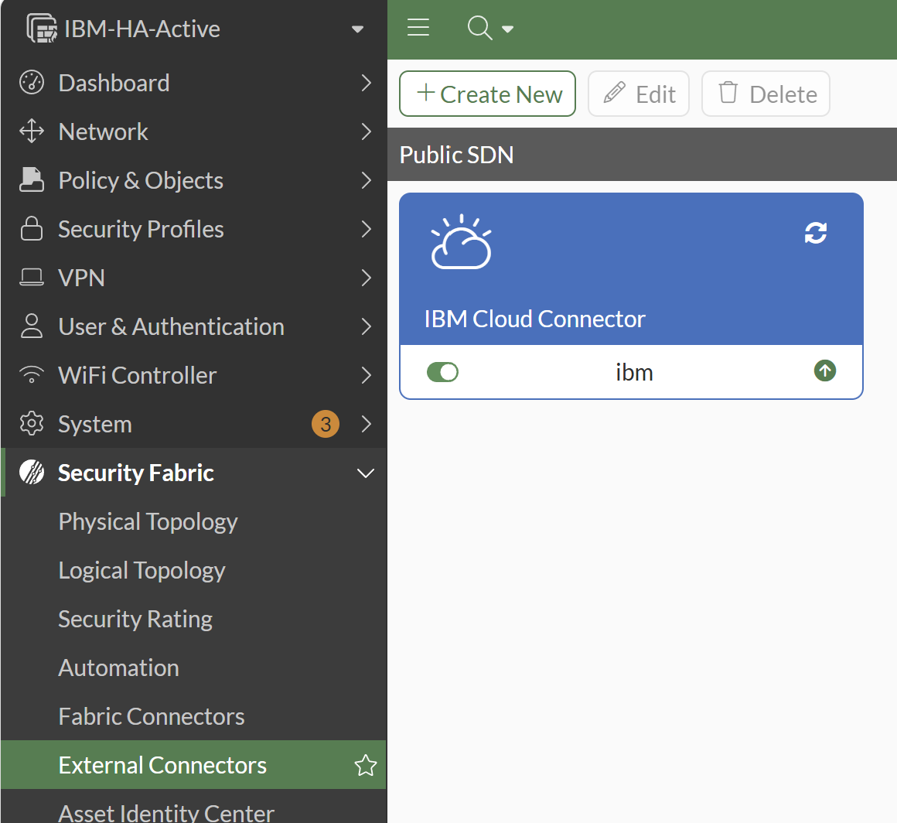{: caption="Image 45" caption-side="bottom"}

Shutdown the primary FortiGate (you can use the Cloud UI for example) while pinging one of the VSIs in the Spoke VPCs (from any of your VSIs simulating the on-premises connectivity).

As the primary FortiGate shutdown, you'll see the ping to fail for few seconds but then working again. The secondary FortiGate took over.

You should prove the IBM Cloud SDN Connector worked by simply verify that all the routes in IBM Cloud have been modified to use, as next hop, the IP address of the interfaces of the secondary FortiGate (10.0.64.10 and 10.0.65.10 where the primary FortiGate was 10.0.0.10 10.0.1.10).

Routes on the Direct Link route table.

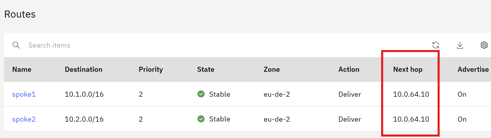{: caption="Image 46" caption-side="bottom"}

Routes on the Ingress route on the Transit Gateway route table.

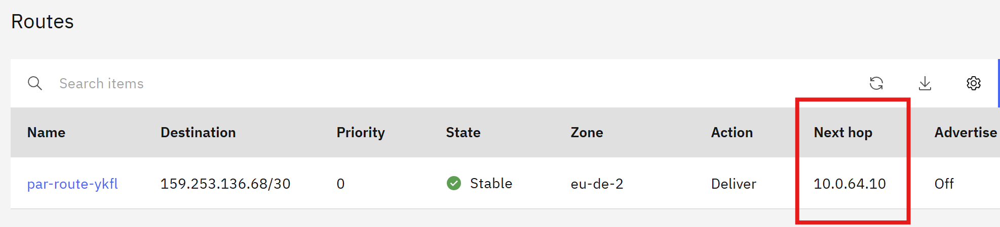{: caption="Image 47" caption-side="bottom"}

You can verify that also the next hop for the public network route table has been dynamically changed from 10.0.0.10 to 10.0.64.10, from the IBM Cloud SDN Connector.

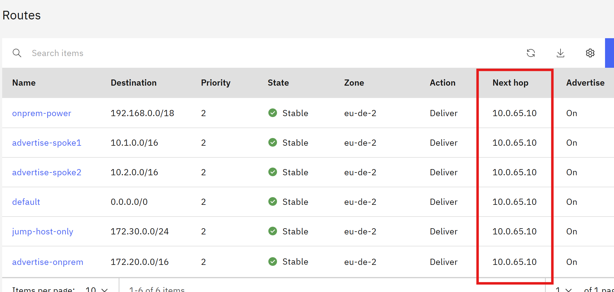{: caption="Image 48" caption-side="bottom"}
